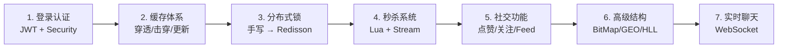

# 校园二手交易平台 — 面试技术亮点全景

> 基于黑马点评改编，以下按模块梳理项目中所有值得在面试中展开的技术点。每个技术点标注了**涉及文件**和**核心关键词**，后续会逐个深入讲解。

---

## 一、用户认证与鉴权

| 关键词 | 技术方案 |
|---|---|
| 无状态认证 | **JWT Token** (Hutool JWT) |
| 安全框架 | **Spring Security** + 自定义 Filter |
| 密码加密 | **BCrypt** |
| 用户上下文 | **ThreadLocal** (`UserHolder`) |

### 核心链路

```
登录 → 验证码存Redis → 校验通过 → 签发JWT → 前端存LocalStorage
         ↓
每次请求 → JwtAuthenticationFilter 解析Token → UserHolder.saveUser()
         → SecurityContext 注入 Authentication
```

**面试亮点**：
- JWT无状态 vs Session有状态的优劣对比
- 为什么同时存 `UserHolder`（ThreadLocal）和 `SecurityContext`
- Token续约与登出策略（Redis黑名单）

**涉及文件**：[UserServiceImpl.java](file:///e:/DianPing/secondHandMarket/2handMarket/src/main/java/com/hmdp/service/impl/UserServiceImpl.java)、[JwtAuthenticationFilter.java](file:///e:/DianPing/secondHandMarket/2handMarket/src/main/java/com/hmdp/utils/JwtAuthenticationFilter.java)、[SecurityConfig.java](file:///e:/DianPing/secondHandMarket/2handMarket/src/main/java/com/hmdp/config/SecurityConfig.java)

---

## 二、Redis 缓存体系

### 2.1 缓存穿透防护

| 策略 | 实现 |
|---|---|
| 空值缓存 | 查DB为空时写入 `""` 到 Redis，TTL 2min |
| 模板方法 | `CacheClient.queryWithPssThrough()` — 泛型 + Function 回调 |

### 2.2 缓存击穿防护（热点Key重建）

| 策略 | 实现 |
|---|---|
| 逻辑过期 + 互斥锁 | `CacheClient.queryWithLogicExpire()` |
| Double Check | 获取锁后再次检查逻辑过期时间，防止重复重建 |
| 异步重建 | 独立线程池 `CACHE_REBUILD_EXECUTOR` 异步刷新缓存 |
| 互斥锁 | `SETNX` 实现轻量锁 ([tryLock](file:///e:/DianPing/secondHandMarket/2handMarket/src/main/java/com/hmdp/service/impl/PostServiceImpl.java#275-279) / [unLock](file:///e:/DianPing/secondHandMarket/2handMarket/src/main/java/com/hmdp/service/impl/ProductServiceImpl.java#225-231)) |

### 2.3 缓存更新策略

| 策略 | 实现 |
|---|---|
| 先更新DB再删缓存 | `ProductServiceImpl.updateProductById()` |

**面试亮点**：
- 三大缓存问题（穿透/击穿/雪崩）的定义、场景和解决方案
- 逻辑过期 vs 物理过期 的取舍
- Double Check 的必要性
- [CacheClient](file:///e:/DianPing/secondHandMarket/2handMarket/src/main/java/com/hmdp/utils/CacheClient.java#19-177) 如何通过泛型 + 函数式接口实现工具化

**涉及文件**：[CacheClient.java](file:///e:/DianPing/secondHandMarket/2handMarket/src/main/java/com/hmdp/utils/CacheClient.java)、[ProductServiceImpl.java](file:///e:/DianPing/secondHandMarket/2handMarket/src/main/java/com/hmdp/service/impl/ProductServiceImpl.java)

---

## 三、秒杀系统（核心高并发模块）

### 3.1 整体架构

```
用户下单 → Lua脚本(原子判断库存+一人一单+写Stream)
                ↓ 返回0=成功
         后台线程池消费 Redis Stream → 扣库存 + 写DB订单
```

### 3.2 关键技术栈

| 环节 | 技术 | 说明 |
|---|---|---|
| 原子判资格 | **Lua 脚本** | 库存检查 + 一人一单判断 + Stream XADD 三步原子执行 |
| 异步削峰 | **Redis Stream** (消息队列) | XREADGROUP + Consumer Group + ACK |
| Pending List | 异常重试 | [handlePendingList()](file:///e:/DianPing/secondHandMarket/2handMarket/src/main/java/com/hmdp/service/impl/VoucherOrderServiceImpl.java#158-196) 消费认领但未ACK的消息 |
| 全局唯一ID | **RedisWorker** | 时间戳(32bit) + Redis INCR序列号(32bit) |
| 分布式锁 | **SimpleRedisLock** + **Redisson** | 手写锁(学习) / Redisson(生产) |
| 乐观锁 | CAS stock > 0 | `setSql("stock = stock - 1").gt("stock", 0)` |

### 3.3 Lua 脚本逻辑 ([seckill.lua](file:///e:/DianPing/secondHandMarket/2handMarket/src/main/resources/seckill.lua))

```
1. GET 库存 → 不足返回1
2. SISMEMBER 检查是否已购 → 已购返回2
3. INCRBY 扣库存 + SADD 记录用户 + XADD 写消息队列
4. 返回0（成功）
```

**面试亮点**：
- 为什么用Lua脚本而不是Java代码做库存判断（原子性）
- Redis Stream vs BlockingQueue vs Kafka 的对比选型
- Pending List 机制保障消息不丢失
- 全局唯一ID的设计思路（Twitter Snowflake 简化版）

**涉及文件**：[VoucherOrderServiceImpl.java](file:///e:/DianPing/secondHandMarket/2handMarket/src/main/java/com/hmdp/service/impl/VoucherOrderServiceImpl.java)、[seckill.lua](file:///e:/DianPing/secondHandMarket/2handMarket/src/main/resources/seckill.lua)、[RedisWorker.java](file:///e:/DianPing/secondHandMarket/2handMarket/src/main/java/com/hmdp/utils/RedisWorker.java)

---

## 四、分布式锁

### 4.1 手写版 — [SimpleRedisLock](file:///e:/DianPing/secondHandMarket/2handMarket/src/main/java/com/hmdp/utils/SimpleRedisLock.java#11-66)

| 特性 | 实现 |
|---|---|
| 加锁 | `SETNX` + TTL |
| 防误删 | Value = UUID + ThreadId，释放前校验 |
| 原子释放 | **Lua 脚本** [unlock.lua](file:///e:/DianPing/secondHandMarket/2handMarket/src/main/resources/unlock.lua) (GET + DEL 原子化) |

### 4.2 生产版 — Redisson

| 特性 | 实现 |
|---|---|
| 可重入锁 | `RLock` |
| 看门狗续期 | 自动续期，防止业务未完成锁过期 |
| 公平锁/联锁 | Redisson 内置 |

**面试亮点**：
- 手写锁的演进过程（SETNX → UUID防误删 → Lua原子释放）
- Redisson 看门狗机制原理
- 为什么不用数据库行锁 / synchronized

**涉及文件**：[SimpleRedisLock.java](file:///e:/DianPing/secondHandMarket/2handMarket/src/main/java/com/hmdp/utils/SimpleRedisLock.java)、[unlock.lua](file:///e:/DianPing/secondHandMarket/2handMarket/src/main/resources/unlock.lua)、[RedissonConfig.java](file:///e:/DianPing/secondHandMarket/2handMarket/src/main/java/com/hmdp/config/RedissonConfig.java)

---

## 五、实时聊天（WebSocket）

| 特性 | 实现 |
|---|---|
| 协议 | **WebSocket** (`@ServerEndpoint`) |
| 会话管理 | `ConcurrentHashMap<userId, Session>` |
| 消息持久化 | 接收即写DB |
| 离线消息 | 对方不在线时存DB，上线后可拉取 |

**面试亮点**：
- WebSocket vs HTTP 长轮询 vs SSE 的对比
- WebSocket在Spring中不是单例的，如何注入Spring Bean（静态 Setter 注入）
- 高并发下 `ConcurrentHashMap` 的选择

**涉及文件**：[WebSocketServer.java](file:///e:/DianPing/secondHandMarket/2handMarket/src/main/java/com/hmdp/utils/WebSocketServer.java)、[ChatMsgServiceImpl.java](file:///e:/DianPing/secondHandMarket/2handMarket/src/main/java/com/hmdp/service/impl/ChatMsgServiceImpl.java)

---

## 六、社交功能

### 6.1 点赞

| 特性 | 实现 |
|---|---|
| 数据结构 | **Redis SortedSet** (`ZADD post:liked:{id}`) |
| 一人一赞 | `ZSCORE` 判断是否已点赞 |
| 点赞排行 | `ZRANGE` 获取 Top N |

### 6.2 关注 / 共同关注

| 特性 | 实现 |
|---|---|
| 数据结构 | **Redis Set** (`follows:{userId}`) |
| 共同关注 | `SINTER`（Set 交集） |

### 6.3 Feed 流（关注推送）

| 特性 | 实现 |
|---|---|
| 推模式 | 发帖时推送到粉丝的 **SortedSet** (`feed:{userId}`) |
| 滚动分页 | `ZREVRANGEBYSCORE` + lastId + offset，避免传统分页的插入偏移问题 |

**面试亮点**：
- 推模式 vs 拉模式 vs 推拉结合的 Feed 流方案
- SortedSet 实现滚动分页的原理
- 为什么点赞用 SortedSet 而不是 Set

**涉及文件**：[PostServiceImpl.java](file:///e:/DianPing/secondHandMarket/2handMarket/src/main/java/com/hmdp/service/impl/PostServiceImpl.java)、[FollowServiceImpl.java](file:///e:/DianPing/secondHandMarket/2handMarket/src/main/java/com/hmdp/service/impl/FollowServiceImpl.java)

---

## 七、Redis 高级数据结构应用

| 功能 | 数据结构 | Key 格式 | 说明 |
|---|---|---|---|
| 签到 | **BitMap** | `sign:{userId}:yyyyMM` | `SETBIT` 签到，`BITFIELD` 统计连续签到 |
| UV 统计 | **HyperLogLog** | `blog:uv:{postId}` | `PFADD` 去重计数，误差约 0.81% |
| 附近商品 | **GEO** | `product:geo:{typeId}` | 启动时预载入，`GEOSEARCH` 按距离排序 |

**面试亮点**：
- BitMap 连续签到算法（位运算 `& 1` + 右移 `>>>`）
- HyperLogLog 的原理和误差率
- GEO 底层是 SortedSet + GeoHash

**涉及文件**：[UserServiceImpl.java](file:///e:/DianPing/secondHandMarket/2handMarket/src/main/java/com/hmdp/service/impl/UserServiceImpl.java) (签到)、[PostServiceImpl.java](file:///e:/DianPing/secondHandMarket/2handMarket/src/main/java/com/hmdp/service/impl/PostServiceImpl.java) (UV)、[ProductGeoDataLoader.java](file:///e:/DianPing/secondHandMarket/2handMarket/src/main/java/com/hmdp/config/ProductGeoDataLoader.java) (GEO)

---

## 八、全局唯一ID生成

```
┌─────────────────────────────────────────────────────┐
│  64位ID = 时间戳(32bit)  <<  32  |  自增序列号(32bit) │
│          (秒级，基于2022.1.1)      (Redis INCR, 按天分Key) │
└─────────────────────────────────────────────────────┘
```

**面试亮点**：
- 对比 UUID / 数据库自增 / Snowflake / Redis INCR 各方案
- 按天分 Key 防止单 Key 溢出，且便于统计

**涉及文件**：[RedisWorker.java](file:///e:/DianPing/secondHandMarket/2handMarket/src/main/java/com/hmdp/utils/RedisWorker.java)

---

## 技术栈速览

| 层次 | 技术 |
|---|---|
| 框架 | Spring Boot + MyBatis-Plus + Spring Security |
| 缓存 | Redis (String / Hash / Set / SortedSet / Stream / BitMap / HyperLogLog / GEO) |
| 分布式锁 | Redisson + 手写 SimpleRedisLock |
| 消息队列 | Redis Stream（轻量替代 Kafka/RabbitMQ） |
| 实时通信 | WebSocket (JSR-356) |
| 脚本 | Lua (秒杀资格判断 + 解锁原子性) |
| 工具 | Hutool (JWT, BeanUtil, JSON) |
| 全局ID | Redis INCR + 时间戳位运算 |
| 数据库 | MySQL + MyBatis-Plus |

---

## 建议学习路径



> 每个模块我们后续逐个深入展开，你想先从哪个模块开始？
